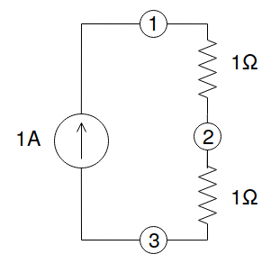

# nodal
Solve linear circuits with nodal analysis.

Written in python, uses numpy for the numerical work.

Currently supports linear networks composed of ideal resistors and current generators.

## Usage example
Suppose we wanted to solve this circuit:



First we would prepare a file describing the circuit. Each line represents a component, using the format    
`name, type, value, first lead, second lead`.

Input file `netlist.csv`:
```
a1,A,1,1,3
r2,R,1,1,2
r3,R,1,2,3
```

Take notice of the orientation of the current generator: current flows toward the node connected to the first lead. Component type can either be
* `A` for current generators
* `R` for resistors

Default units are ampere and ohm.

We can then execute `$ python nodal.py netlist.csv` to get the list of node potentials (unit is volt).

Printed output:
```
Ground node: 2
e(1) = [ 1.]
e(3) = [-1.]
```

