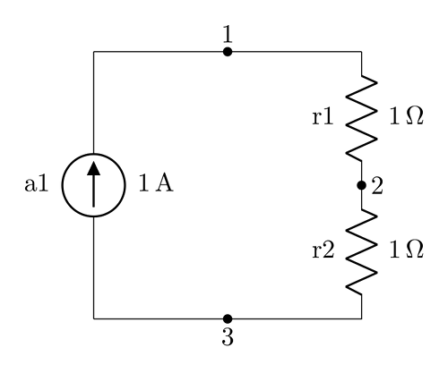
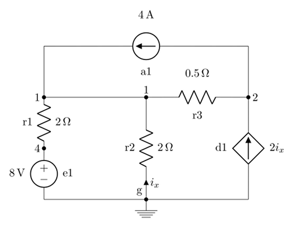
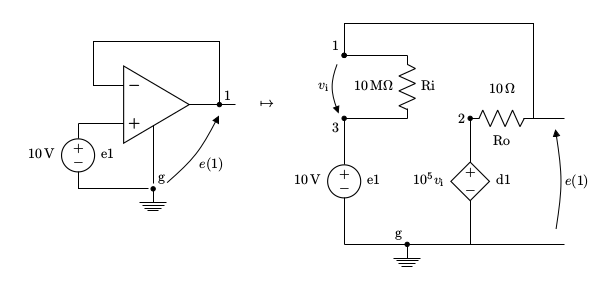

# Nodal.py
Nodal.py is a simple electrical circuit simulator that uses nodal analysis to solve linear networks made up of resistors and ideal current or voltage sources, both independent and controlled. The numerical work is done by the [numpy](https://www.numpy.org/) package.

## Usage example
Suppose we wanted to solve this circuit:



First we would prepare a file describing the circuit. Each line represents a component, using the format    
`name, type, value, first lead, second lead`.

Input file `netlist.csv`:
```
a1,A,1,1,3
r2,R,1,2,3
r3,R,1,1,2
```

Take notice of the orientation of the current generator: current flows toward the node connected to the first lead. Component type can either be
* `A` for current generators
* `R` for resistors

Default units are ampere and ohm.

We can then execute `$ python solver.py netlist.csv` to get the list of node potentials (unit is volt).

Printed output:
```
Ground node: 2
e(1)    = 1.0
e(3)    = -1.0
```

## A more advanced example



_Example circuit from: [Esercizi da temi d'esame di Elettrotecnica](http://home.deib.polimi.it/damore/download/temiDEsame.pdf)_

Input file `1.6.1.csv`:
```
r1,R,2,1,4
r2,R,2,1,g
r3,R,0.5,1,2
e1,E,8,4,g
a1,A,4,1,2
d1,CCCS,2,2,g,1,g,r2
```

Output:
```
Ground node: g
e(1)    = 2.0
e(2)    = -1.0
e(4)    = 8.0
i(d1)   = -2.0
i(e1)   = 3.0
```

# Complete component specification

| | Type | Value | Lead + | Lead - | Control + | Control - | Driver |
|---|---|---|---|---|---|---|---|
Resistor | R | resistance (ohm) | first | second | NA | NA | NA |
Voltage source | E | voltage (volt) | + voltage | ground | NA | NA | NA |
Current source | A | current (ampere) | + current | ground | NA | NA | NA |
CCCS | CCCS | gain (adimensional) | + current | ground | + driving current | - driving current | component determining the current |
CCVS | CCVS | gain (ohm) | + tension | ground | + driving current | - driving current | component determining the current |
VCCS | VCCS | gain (ohm^-1) | + current | ground | + driving voltage | - driving voltage | NA |
VCVS | VCVS | gain (adimensional) | + voltage | ground | + driving voltage | - driving voltage | NA |

## Modeling operational amplifiers
Opamps are not supported directly, but we can use an equivalent circuit. For example we can simulate a voltage buffer:



Output:
```
Ground node: g
e(1)    = 9.999900000999991
e(2)    = 9.999900000635535
e(3)    = 9.999999999999998
i(d1)   = -3.2741537359603055e-11
i(vs)   = 9.999900000878983e-12
```
